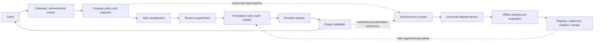

# Architecture

This is a Python monorepo with one installable package initially. Logical service boundaries
are documented in `services/README.md`; extraction follows independent scaling or ownership.
The application currently exposes only health and API documentation.

This diagram describes the target architecture, not implemented services.
Local development will use synthetic fixtures, a fake provider and SQLite metadata with
separate encrypted payloads. Production database, event transport, object storage, identity,
key management and regional deployment await owner decisions. Adapters must allow replacing
local implementations without changing canonical contracts.

Canonical requests cannot supply trusted tenant identities or system/tool roles. Authentication
will derive tenant, subject, environment and allowed application. All budgets are bounded;
money is integer USD micros (a deliberate API adaptation from decimal dollars in the spec).
Unknown provider token categories remain null, with explicit accounting provenance.

Live specialist routing and all training are disabled initially. No future research artifact
may bypass the standard registry, signatures, evaluations and approval gates.

## References used for scaffolding

- [FastAPI lifespan](https://fastapi.tiangolo.com/advanced/events/): application startup/shutdown.
- [Pydantic models](https://docs.pydantic.dev/latest/concepts/models/): validated contracts.
- [Pydantic JSON Schema](https://docs.pydantic.dev/latest/concepts/json_schema/): schema exports.
- [Fernet authenticated encryption](https://cryptography.io/en/stable/fernet/): candidate for
  bounded local payload encryption, pending storage implementation; production KMS is unresolved.

